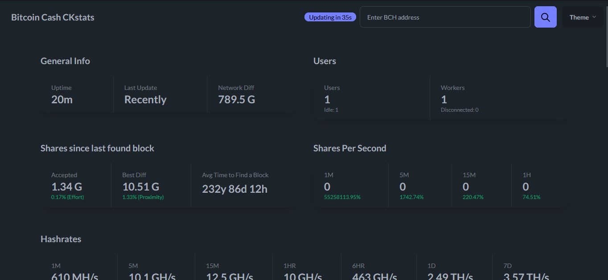

# CKPool‑Bitcoin-Cash: Solo Mining
A fully integrated, deterministic solo‑mining pool for Bitcoin-Cash (BCH), combining:

-CKPool — optimized CKPool fork for Bitcoin-Cash

-Bitcoin-Cash Core — full node providing consensus, mempool, and block validation

-CKStats — modern Next.js dashboard for real‑time pool monitoring

-Systemd services — production‑grade orchestration

-Artifact‑free configs — clean, reproducible, deterministic setup

-This repository provides everything required to run a self‑hosted, autonomous Bitcoin cash solo‑mining pool.

---
## 🚀 Features

### CKPool
-Lightweight, high‑performance solo mining pool

-Supports ASICs

-Custom BCH‑specific patches

-Clean configuration (ckpool.conf)

-Built‑in stratum server

-Coinbase tag support via btcsig

-Bitcoin-Cash Core

-Full Bitcoin-BCH node

-Provides block templates to CKPool

-Validates mined blocks

-Exposes RPC for pool operations

-Clean, unbuilt source included for reproducibility
``
## CKStats Dashboard
-Next.js + Tailwind + TypeORM

-Real‑time miner stats

-Worker performance

-Pool health

-Block submissions

-PostgreSQL backend

-Clean .env.example included

-Systemd Integration
-ckpool.service

-bitcoin.service

-ckstats.service

-Automatic restart

-Log rotation ready
``
``
## 🔧 Build Instructions
``
-Bitcoin-Cash Core
-This repository includes the full unbuilt Bitcoin Cash Node (BCHN) source.
-BCHN does NOT use Autotools.
-Do NOT run ./autogen.sh, ./configure, or make.
``
## Install dependencies:
``
Code
sudo apt update
sudo apt install -y \
  build-essential \
  cmake \
  ninja-build \
  pkg-config \
  libssl-dev \
  libevent-dev \
  libboost-all-dev \
  libzmq3-dev \
  libsqlite3-dev \
  python3
``

## Build BCHN:
``
Code
cd bitcoin-cash
mkdir build
cd build
cmake -GNinja ..
ninja
``
## Install binaries:
``
Code
mkdir -p ~/Bitcoincash/bin
cp src/bitcoind src/bitcoin-cli src/bitcoin-tx ~/Bitcoincash/bin/
CKPool
Code
sudo apt-get install build-essential yasm libzmq3-dev
./configure
make
``
## CKStats Dashboard
-Install Dependencies:

-Install pnpm if not already available:
``
Code
curl -fsSL https://get.pnpm.io/install.sh | bash
Code
cp .env.example .env  
pnpm install  
pnpm build  
pnpm start
``
## ⚙️ Systemd Setup (Manual Creation)
-Create Bitcoin-Cash service
-Code
``
sudo nano /etc/systemd/system/bitcoincash.service
``
-Code
``
[Unit]
Description=Bitcoin-Cash Daemon
After=network.target

[Service]
ExecStart=/home/umbrel/bitcoin-cash/src/bitcoind -conf=/home/umbrel/bitcoin-cash/ckpool/configs/bitcoin.conf
User=umbrel
Restart=always
TimeoutStopSec=90
Type=simple

[Install]
WantedBy=multi-user.target
``
## Create CKPool‑BCH service
-Code
``
sudo nano /etc/systemd/system/ckpoolbch.service
Code
[Unit]
Description=CKPool-BCH Solo Pool
After=network.target bitcoin.service

[Service]
ExecStart=/home/umbrel/bitcoin-cash/ckpool/src/ckpool -c /home/umbrel/bitcoin-cash/ckpool/ckpool.conf
User=umbrel
Restart=always
Type=simple

[Install]
WantedBy=multi-user.target
``
## Create CKStats Dashboard service
-Code
``
sudo nano /etc/systemd/system/ckstatsbch.service
Code
[Unit]
Description=CKStats Dashboard
After=network.target postgresql.service

[Service]
WorkingDirectory=/home/umbrel/bitcoin-cash/ckstats
ExecStart=/usr/bin/pnpm start
User=umbrel
Restart=always
Environment=NODE_ENV=production
Type=simple

[Install]
WantedBy=multi-user.target
``
## Enable and start all services
-Code
``
sudo systemctl daemon-reload
sudo systemctl enable bitcoin-cash ckpool ckstatsbch
sudo systemctl start bitcoin-cash ckpool ckstatsbch
``
## 🔥 PM2 Setup (Alternative to Systemd)
PM2 is a lightweight process manager that can supervise Bitcoin-Cash Core, CKPool‑BCH, and CKStats.

1. Install PM2
Code
sudo npm install -g pm2
pm2 -v
2. Start Bitcoin-sv Core under PM2
-Code
``
pm2 start /home/umbrel/bitcoin-cash/src/bitcoind --name bitcoin-cash -- \
  -conf=/home/umbrel/bitcoin-cash/data/bitcoin.conf \
  -daemon=0
 `` 
## Logs:

-Code
``
pm2 logs bitcoin-cash
3. Start CKPool‑BCH under PM2
Code
pm2 start /home/umbrel/bitcoin-cash/ckpool-bch/ --name ckpool-bch -- \
  -c /home/umbrel/bitcoin-cash/ckpool/ckpool.conf
``
## Logs:

-Code
``
pm2 logs ckpool-bch
``
## 4. Start CKStats under PM2
-Code
cd /home/umbrel/bitcoin-cash/ckstats
``
pm2 start pnpm --name ckstats-bch -- start
``
## Logs:

-Code
``
pm2 logs ckstats
``
## 5. Save PM2 Process List
-Code
``
pm2 save
``
## 6. Enable PM2 Startup on Boot
-Code
``
pm2 startup
``
## Follow the printed command.

## 7. PM2 Management Commands
Status:

-Code
``
pm2 status
``
## Restart:

-Code
``
pm2 restart bitcoin-cash
pm2 restart ckpool-bch
pm2 restart ckstats-bch
``
## Stop:

--Code
``
pm2 stop bitcoin-cash
pm2 stop ckpool-bch
pm2 stop ckstats-bch
``
## Delete:

-Code
``
pm2 delete bitcoin-cash
pm2 delete ckpool-bch
pm2 delete ckstats-bch
``
## Check CKStats:
Open browser:

http://<your-ip>:3001
🛡️ Security Notes
Never expose CKPool or Bitcoin-Cash RPC to the public internet

Use firewall rules to restrict access

Keep .env files private

Only .env.example is committed

## 📜 License
CKPool‑BCH: GPLv2

Bitcoin-BCH Core: MIT

## CKStats: MIT

## 🤝 Contributing
Pull requests are welcome.
For major changes, open an issue first to discuss what you’d like to modify.
